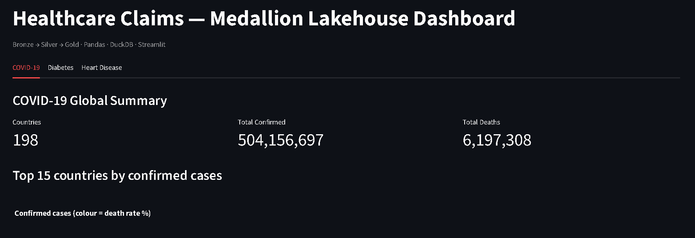

# Medallion Lakehouse Data Engineering Platform

A healthcare analytics platform built on **Bronze → Silver → Gold** medallion architecture using real public datasets.



## Architecture
Raw Online Data (COVID-19, Diabetes, Heart Disease)
↓
Bronze Layer (raw ingestion + metadata)
↓
Silver Layer (cleaning, deduplication, null handling)
↓
Gold Layer (business aggregations + KPIs)
↓
FastAPI (REST endpoints) + Streamlit (dashboard)

## Tech Stack

| Tool | Purpose |
|------|---------|
| Pandas | Data ingestion and transformation |
| DuckDB | Fast local SQL analytics |
| Delta-style Parquet | Lakehouse storage format |
| FastAPI | REST API for analytics |
| Streamlit | Interactive dashboard |
| Plotly | Charts and visualizations |
| Docker Compose | Local infrastructure |
| Apache Airflow | Pipeline orchestration (DAG) |

## Datasets

| Dataset | Source | Rows |
|---------|--------|------|
| COVID-19 Cases | github.com/datasets/covid-19 | 161,568 |
| Pima Diabetes | plotly/datasets | 768 |
| UCI Heart Disease | UCI ML Repository | 303 |

## Quick Start

```bash
git clone https://github.com/shubhamtiw17/medallion-lakehouse-platform
cd medallion-lakehouse-platform

pip install pandas duckdb fastapi uvicorn streamlit plotly pyarrow

# Run the full pipeline
python layers/bronze/ingest.py
python layers/silver/clean.py
python layers/gold/aggregate.py

# Start the API
uvicorn api.main:app --reload --port 8000

# Start the dashboard (new terminal)
python -m streamlit run dashboard/app.py
```

## API Endpoints

| Endpoint | Description |
|----------|-------------|
| `GET /` | Service info |
| `GET /health` | Health check |
| `GET /covid/summary` | Top 20 countries by cases |
| `GET /covid/top-deaths` | Top 10 by death count |
| `GET /diabetes/by-age` | Diabetes rate by age group |
| `GET /heart/by-age-sex` | Heart disease by age and sex |

## Project Structure

medallion-lakehouse-platform/
├── layers/
│   ├── bronze/          # Raw ingestion scripts
│   ├── silver/          # Cleaning scripts
│   └── gold/            # Aggregation scripts
├── api/                 # FastAPI app
├── dashboard/           # Streamlit app
├── dags/                # Airflow DAG
├── validation/          # Data quality checks
└── docker-compose.yml   # Local infrastructure

## What I Built

- Medallion (Bronze/Silver/Gold) lakehouse architecture from scratch
- Incremental data ingestion from 3 live public URLs
- Data cleaning pipeline with null handling and deduplication
- Business aggregations with real KPIs (death rates, diabetes rates)
- REST API with auto-generated Swagger docs
- Interactive multi-tab analytics dashboard
- Airflow DAG for pipeline orchestration
- Docker Compose for full local deployment

> Note: Pipeline uses Pandas locally for Windows compatibility.
> Production design uses PySpark + Delta Lake on Linux/cloud.